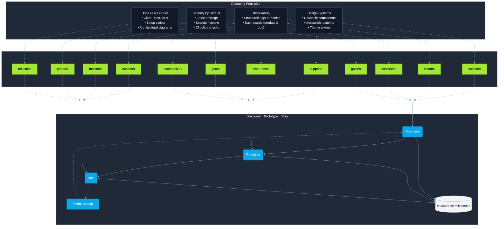

<h1> Ivan Roman </h1>  
<h3> Full-Stack Developer • Modern Indie Hacker • New Mexico Native </h3>
<h4> Building enterprise SaaS platforms and cultural tech experiences with Next.js 15, React 19, and an entrepreneurial spirit. </h4>

---

<!-- Badges -->

  
  
  
  
  
  
  
  
  
  
  
  
  
  
  
  
  
  
  
  
  
  
  
  
  
  
  
  
  
  
  
  
  
  
  
  
  

---

  

---

## 🌎 About Me
I’m a New Mexico native blending **enterprise-grade engineering** with **cultural storytelling** and **entrepreneurial hustle**.  
My work combines SaaS design, real-world analytics, and creative brand expression—applications that are as useful for businesses as they are authentic to communities.  

- 🏢 **Enterprise:** Multi-tenant SaaS, RBAC/ABAC, compliance & reporting  
- 🎨 **Culture-forward:** Tech that integrates Latino/Hispanic identity, storytelling, and brand  
- 🚀 **Operator mindset:** Build for efficiency, margins, and scale  
- 🤖 **AI & Automation:** Context tooling, LLM workflows, domain-specific automation  

---

## 🛠️ Tech Stack
- **Frontend:** Next.js 15 (App Router, RSC), React 19, Tailwind CSS 4, shadcn/ui, Radix  
- **Backend:** Node.js, React Server Actions, Vercel Edge Functions, Express (legacy)  
- **Data:** PostgreSQL (Neon), Prisma ORM, Redis cache layers, analytics dashboards with Nivo & Recharts  
- **Auth & Security:** Clerk, JWT, ABAC/RBAC, SVIX, rate-limiting with Upstash  
- **Tooling & QA:** Vitest, Playwright, Testing Library, GitHub Actions CI/CD  
- **Architecture:** Modular monorepos, microservices, event-driven actions, domain-driven design  
- **Deployment:** Vercel (frontend/edge), Render (backends), GitHub Pages (static), automated workflows  

---

## 🚀 Featured Projects
> *Where enterprise meets entrepreneurship, and culture meets code.*

### 🚚 Fleet Fusion — Next-Gen Fleet Management SaaS  
**Repo:** [DigitalHerencia/FleetFusion](https://github.com/DigitalHerencia/FleetFusion)  
**Live Demo:** **https://fleet-fusion.vercel.app**  
- **What it is:** A Transportation Management System (TMS) for small-to-midsize logistics operators.  
- **Features:**  
  - Dispatch board for assigning loads  
  - Driver & vehicle management with compliance docs  
  - IFTA fuel tax reporting module  
  - Billing workflows with audit logs  
  - Role-based access (RBAC/ABAC) for dispatchers, admins, drivers  
- **Architecture:**  
  - Next.js 15 + React 19 client, Prisma ORM on Neon/Postgres  
  - Modular domains: `/features/dispatch`, `/features/billing`, `/features/ifta`  
  - Real-time actions via Clerk-authenticated server actions  
  - Edge deployment via Vercel for speed and scaling  

  

---

### 🧠 Codebase Context Utility — LLM-Ready Context Tool  
**Repo:** [DigitalHerencia/CodebaseContextUtility](https://github.com/DigitalHerencia/CodebaseContextUtility)  
**Live Demo:** **https://codebase-context-utility.vercel.app**  
- **What it is:** A developer tool that transforms source repos into structured LLM-ready context.  
- **Features:**  
  - Automatic dependency mapping and module graph  
  - Token estimation for GPT-friendly chunking  
  - JSON + Markdown output for embedding pipelines  
  - Integrates seamlessly into AI coding workflows  
- **Architecture:**  
  - Next.js frontend, Node/TypeScript backend  
  - Static analysis of TS/JS repos  
  - Exportable context for Codex or GPT-powered assistants  

  

---

### 💰 Hustler's Code — Street-Smart Business Analytics  
**Repo:** [DigitalHerencia/HustlersCode](https://github.com/DigitalHerencia/HustlersCode)  
**Live Demo:** **https://hustlerscode.vercel.app**  
- **What it is:** A business intelligence dashboard built for hustlers and small-scale entrepreneurs.  
- **Features:**  
  - POS-lite functionality (sales + cash flow)  
  - Inventory tracking for high-turnover items  
  - Profit margin analytics and hustler-friendly UI  
  - Optimized for quick pivots and real-world testing  
- **Architecture:**  
  - SaaS dashboard template with Clerk auth  
  - Analytics-first, with Prisma + Neon as the backbone  

  

---

### 🔥 Siempre Nuevo — Culture-Forward Streetwear  
**Repo:** [DigitalHerencia/SiempreNuevo](https://github.com/DigitalHerencia/SiempreNuevo)  
**Live Demo:** **https://siemprenuevo.vercel.app**  
- **What it is:** A bold streetwear storefront built with Next.js.  
- **Features:**  
  - Clothing catalog with cart + checkout flow  
  - Brand aesthetic inspired by NM women’s culture  
  - Responsive mobile-first design  
- **Architecture:**  
  - Headless Next.js storefront, integrated payment hooks  
  - Shadcn/ui + Tailwind for design system  

  

---

### 🗣️ Free the Homie — Fundraising Platform  
**Repo:** [DigitalHerencia/FreeTheHomie](https://github.com/DigitalHerencia/FreeTheHomie)  
**Live Demo:** **https://freethehomie.vercel.app**  
- **What it is:** A modern fundraising storefront.  
- **Features:**  
  - T-shirt storefront funding community causes  
  - AI-driven content powered by v0.app to tell the story  
  - Social-share optimized and mobile-friendly  
- **Architecture:**  
  - Next.js SaaS shell with Clerk auth  
  - Integrated Stripe + server actions  

  

---

### 📸 Portrait Planner — AI-Enhanced Photography Session Planning  
**Repo:** [DigitalHerencia/PortraitPlanner](https://github.com/DigitalHerencia/PortraitPlanner)  
**Live Demo:** **https://portraitplanner.vercel.app/**  
- **What it is:** A modern planning tool for photographers and studios to organize sessions, build moodboards, and streamline client communication.  
- **Highlights:**  
  - Session scheduling with editable shot plans and deadlines  
  - Moodboard creation to collect references and inspiration per shoot  
  - Gallery & deliverables view to keep client assets centralized  
  - PWA-ready with offline support for on-site work  
  - Theming (dark/light) with customizable tokens for brand fit  
- **Architecture:**  
  - Next.js 15 + React 19, fully typed components  
  - UI built on Tailwind v4 + shadcn/ui + Radix primitives  
  - Forms via React Hook Form + Zod; state via Context + next-themes  
  - Image handling using **@vercel/blob**; analytics via Recharts  
  - Workbox service worker for precaching & runtime strategies  
- **Why it matters:** Turns creative chaos into a predictable workflow, reducing missed shots and client back-and-forth.  

  

---

## 🧭 How I Work

---

## 🤝 Let’s Build Something
📧 **Contact:** [Open an Issue](https://github.com/DigitalHerencia/DigitalHerencia/issues)  
🔗 **Portfolio:** Explore live demos above  
🌟 **Open to:** Full-time roles, contracting, OSS collaborations, and partnerships  

---

> *“Knowledge is power, but applied knowledge is profit.”*
